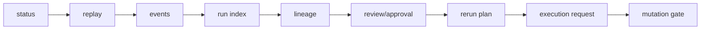

# ForgeFlow Runtime v0 Architecture (Control Plane)

Legend (v0):

- **Source-of-truth**: run-scoped `summary.json`, `events.jsonl`, `lineage.json`, `review_state.json`, `approvals/*.json`.
- **Cache**: `.forgeflow/runs/index.json` is materialized and may lag behind truth.
- **Intent artifacts**: `rerun_plan.json` and `execution_request.json` describe intent, not factual truth.
- Execution engine is intentionally absent; mutation remains disabled by design.
- `--enable-mutation` is gate diagnostics only (blocked / not implemented).
